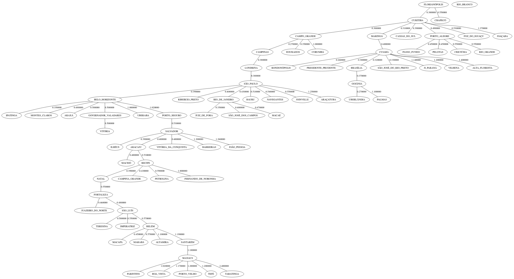

# Graphs-trip

This project is a prerequisite to conclude the "Programação II" class. This was a project of my choice, and the end goal is to finding routes between cities using minimum spanning tree.

## Objective

The purpose of this project is to determine the path with the minimum cost relative to time that interconnect any given cities.

## The chose way

To accomplish the task it was implemented the Prim's Algorithm to generate the path with the lowest cost relative to the weight of the path.
Here is one demonstration of the Prim's Algorithm:

By Shiyu Ji - Own work, CC BY-SA 4.0, https://commons.wikimedia.org/w/index.php?curid=54420894

The Algorithm was coded in C and implemented using a chained list, it was used a table with the time between the major cities in my home country to test the code.

## Results

The tests were consistent, here's the result of the algorithm:

If you pay attention there's one isolated city in the top right of the image, this
wasn't a bug im my code, rather, the tool that I used to generate the graph.

## Considerations

It would be more efficient if the graph was implemented using adjacency matrix insted
of chained lists like I did here.
